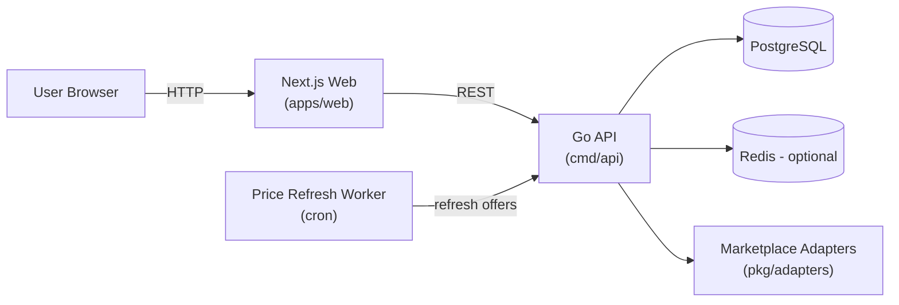
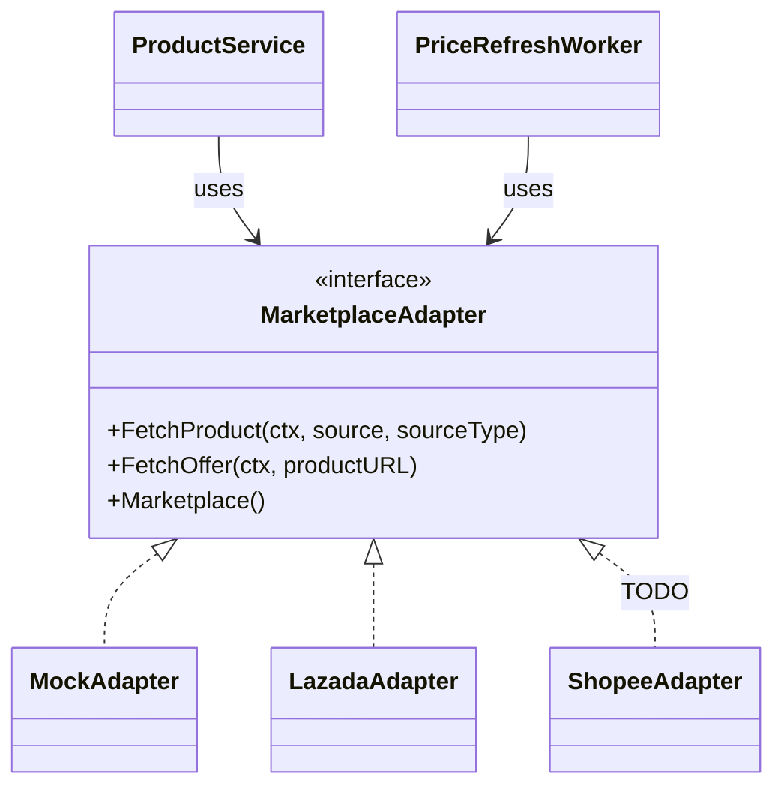

# Affiliate Platform (Price Comparison + Campaigns + Short Links)

## Project Overview

A mini affiliate web application for **promotion landing pages**, **Lazada/Shopee price comparison**, **affiliate short links**, and **click analytics**.

The codebase focuses on a clean, modular architecture with marketplace adapters (real or mock), a background price refresh job, and pragmatic testing/CI.

## Problem Understanding & Scope

### What this system solves

Affiliate/promotion platforms need a reliable flow from **campaign creation** → **user click** → **redirect** → **tracking** while keeping marketplace integrations replaceable (APIs change, rate limits exist, scraping is brittle).

### MVP scope (intentionally)

- Model core domains: products, offers, campaigns, links, clicks
- Support a realistic affiliate redirect flow (`/go/:short_code`) with click tracking
- Abstract marketplaces behind adapters to allow adding/removing marketplaces without refactoring core logic
- Provide an admin UI + a public campaign landing page for end-to-end testing

### Out of scope (intentional)

- Authentication/authorization (kept out to reduce setup friction)
- Impression tracking (CTR here is a simplified proxy based on clicks)
- Conversion/revenue attribution and anti-fraud mechanisms
- Full production hardening (rate limiting, caching strategy, observability, RBAC)

## Key Features (MVP)

- **Product price comparison** between Lazada and Shopee
- **Marketplace adapters** (mock fixtures + optional real integration)
- **Campaign management** with UTM configuration and date range
- **Affiliate short link generation**
- **Redirect + click tracking** via `GET /go/:short_code`
- **Public campaign landing page**
- **Admin analytics dashboard** (clicks, CTR proxy, top products)
- **Background price refresh job**

## Architecture & Design Decisions

### Architecture overview



### Key boundaries (backend)

- **`internal/api`**: routing + HTTP handlers + DTOs
- **`internal/service`**: business logic (campaign, product, link, redirect, dashboard)
- **`internal/repository`**: persistence layer (GORM)
- **`pkg/adapters`**: marketplace integration boundary
  - **`pkg/adapters/mock`** uses embedded JSON fixtures (`pkg/adapters/mock/fixtures/products.json`)
  - **`pkg/adapters/lazada`** includes a real adapter (requires credentials)
  - **`pkg/adapters/shopee`** is scaffolded (TODO: implement real API integration)

### Why adapter pattern

Marketplace APIs differ (auth, data models, quotas). The adapter interface lets core logic depend on a stable contract (`FetchProduct`, `FetchOffer`), keeping external changes localized to the adapter package.

### Adapter design (dependencies, mock vs real)

#### Dependency direction

Core business logic depends on the **interface** (`MarketplaceAdapter`), not on concrete marketplace integrations.



#### How mock works today

- **Data source**: embedded JSON fixtures (`pkg/adapters/mock/fixtures/products.json`)
- **Selection**: when you submit a Lazada/Shopee URL, the mock adapter maps it to a fixture product (or picks a deterministic/random product from fixtures depending on the code path)
- **Offers**: Lazada/Shopee offers are read from the same fixture record and stored into `offers` with `marketplace_product_url` + `last_checked_at`

This keeps the MVP deterministic and runnable without credentials, while still exercising the full domain flow (campaign → link → redirect → dashboard).

#### How to enable real marketplaces (production path)

Right now the app is wired to use mock adapters by default. To use real integrations:

- **Lazada**:
  - Provide Lazada Open Platform credentials (app key/secret + access token)
  - Instantiate `pkg/adapters/lazada` and wire it into the API route setup + worker
- **Shopee**:
  - Implement the TODOs in `pkg/adapters/shopee` (partner API) and wire it in the same way

A production-ready approach is to add an **adapter factory** (e.g. `internal/adapters/factory`) that selects implementations based on config/env (mock in dev, real in prod), and reuse the same factory from:

- API bootstrap (`internal/api/router.go`)
- background worker (`internal/worker/price_refresh.go`)

## Data Model Overview

### Core entities

- **Product**: a logical product record, independent of marketplace
- **Offer**: marketplace-specific price/store info for a product
- **Campaign**: marketing container with UTM configuration and time window
- **CampaignProduct**: many-to-many join table associating products with campaigns (used to determine which products appear on public campaign landing pages)
- **Link**: short link binding campaign + product + marketplace
- **Click**: tracking event recorded on each redirect

### Entities (high-level fields)

| Entity | Key fields |
|---|---|
| **Product** | `id`, `title`, `image_url` |
| **Offer** | `id`, `product_id`, `marketplace`, `store_name`, `price`, `last_checked_at`, `marketplace_product_url` |
| **Campaign** | `id`, `name`, `utm_campaign`, `start_at`, `end_at` |
| **CampaignProduct** | `id`, `campaign_id`, `product_id` |
| **Link** | `id`, `product_id`, `campaign_id`, `marketplace`, `short_code`, `target_url` |
| **Click** | `id`, `link_id`, `timestamp`, `referrer`, `user_agent`, `ip_address` |

## Core Flows

### Flow: affiliate click tracking

1. Admin adds a product (Lazada/Shopee references)
2. System stores product and marketplace offers
3. Admin creates a campaign (UTMs, start/end) and associates products via `CampaignProduct`
4. Admin generates an affiliate short link per product + marketplace
5. Public users open a campaign landing page and click “Buy”
6. Web calls `GET /go/:short_code`
7. API validates redirect URL (whitelist check) to prevent open redirect vulnerabilities, records a click event, and redirects to the marketplace URL (with UTMs)
8. Admin dashboard aggregates click stats

### Flow: price refresh

1. Cron job loads products/offers
2. For each offer, select the matching marketplace adapter
3. Fetch latest offer price/store
4. Update offer and `last_checked_at`

## API Overview

The API is intentionally designed around core domain actions rather than CRUD-style resources.

- **Swagger**: `http://localhost:8080/swagger/index.html`
- **Health**: `GET /health`

### Key endpoints

- `POST /api/products` – add a product and seed offers
- `POST /api/campaigns` – create a campaign
- `POST /api/links` – generate short links
- `GET /go/:short_code` – track click + redirect
- `GET /api/dashboard` – analytics summary

See Swagger for the full list of endpoints and schemas.

## Background Jobs

The API process starts a cron-based worker that periodically refreshes offers:

- **Schedule**: configured via `worker.price_refresh_cron` (6-field cron with seconds; default: every 6 hours)
- **What it does**: refreshes `price`, `store_name`, `marketplace_product_url`, and updates `last_checked_at`
- **Manual trigger**: `POST /api/worker/refresh-prices`

## Local Development Setup

See [QUICKSTART.md](./QUICKSTART.md) for step-by-step instructions.

### One-liner

```bash
make init && make mu && make start
```

### Web API base URL (optional)

The web app defaults to `http://localhost:8080`. To override locally:

```bash
cp apps/web/env.example apps/web/.env.local
```

## Demo

If you have a deployed environment, add:

- **Public site**: `<PUBLIC_URL>`
- **Admin UI**: `<PUBLIC_URL>/admin` (no authentication required in demo)
- **Swagger**: `<PUBLIC_URL>/swagger/index.html`

**Sample data for testing**:
- Campaign: `Summer Sale 2025`
- Product: `Premium Matcha Powder 100g` (available on both Lazada and Shopee)

## Testing & CI

- **Unit tests**: `go test ./... -short`
- **Integration tests** (Postgres required): `go test -tags=integration ./...`
- **CI**: GitHub Actions runs unit + integration + lint + build (`.github/workflows/ci.yml`)

## Trade-offs & Assumptions

- **Marketplace data**: defaults to **mock fixtures** to keep the project deterministic and easy to run without credentials; real adapters can be enabled/extended later.
- **Auth**: intentionally skipped to minimize setup friction; production would add session/JWT + RBAC + audit trails.
- **CTR**: treated as a simplified proxy metric (clicks per generated link) rather than a true impression-based CTR.
- **Redirect safety**: redirect targets are always resolved from persisted links and validated against a whitelist to prevent open redirect vulnerabilities.
- **Redis**: provisioned but optional; intended for caching, rate limiting, and precomputed analytics.

## Future Improvements

- Real marketplace API integrations with retries, rate limiting, and caching
- Impression tracking for accurate CTR
- Conversion and revenue tracking
- Role-based access control (RBAC) + audit logs
- Observability: request IDs, structured logs, metrics, tracing

